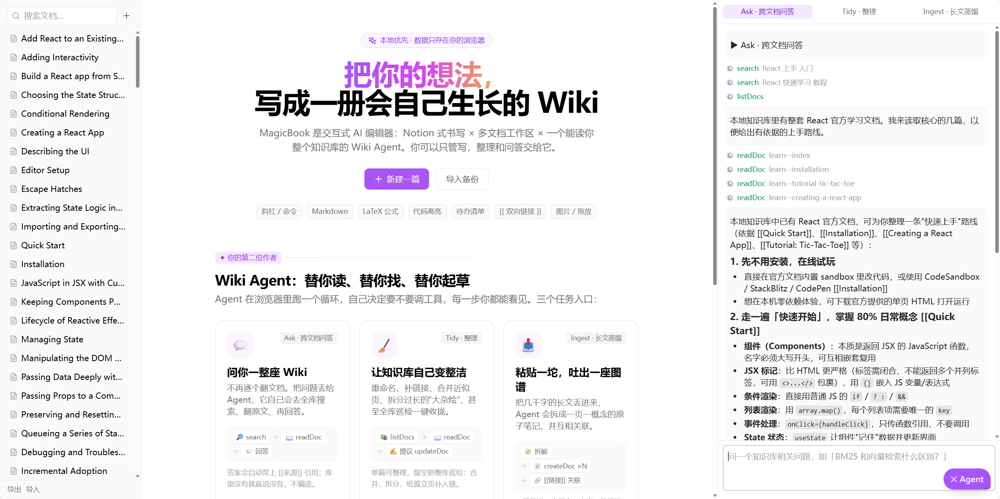
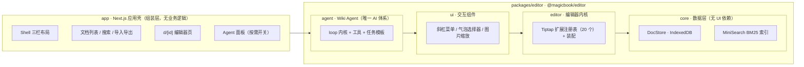
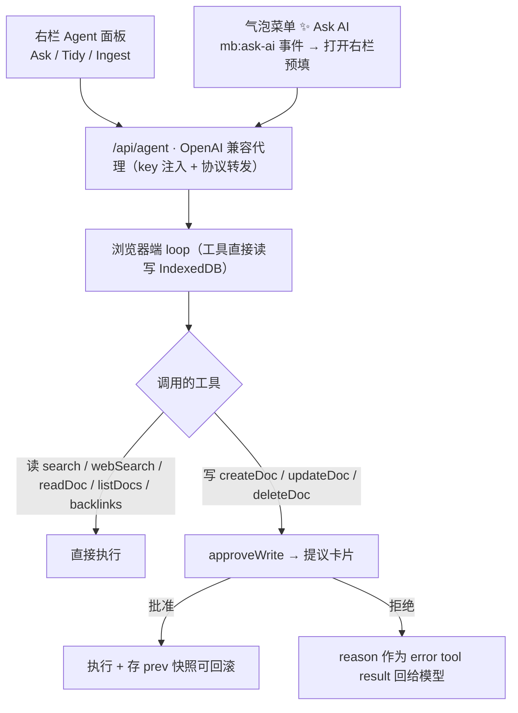
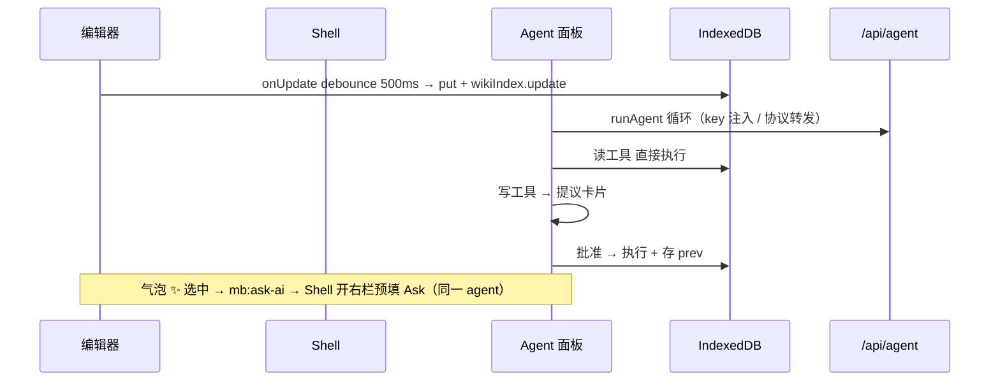

# ✨ MagicBook

### 交互式 AI 编辑器 → LLM Wiki demo

**Notion 风格富文本** × **多文档工作区** × **自主 Wiki Agent**

  
  
  
  
  
  
  

  <a href="https://magicbook-mauve.vercel.app/"
     style="display: inline-block; padding: 16px 36px; font-size: 22px; font-weight: 700; color: #fff;
            background: linear-gradient(135deg, #a855f7 0%, #d946ef 60%, #f59e0b 130%);
            border-radius: 9999px; text-decoration: none; letter-spacing: 0.5px;
            box-shadow: 0 8px 20px rgba(168, 85, 247, 0.4);">
    ▶ 打开在线 Demo
  </a>

  <a href="https://magicbook-mauve.vercel.app/" style="color: #7c3aed; font-size: 15px; text-decoration: none; font-weight: 500;">
    magicbook-mauve.vercel.app
  </a>

> 状态：**§0–14 已完成**（见 [`features.md`](./features.md)）· §15（Vercel 部署）仅剩环境配置待做

---

## 🧭 这是什么

一个把「编辑器」往「LLM Wiki」方向做的实验性 demo：

- 📝 **写** —— Notion 式富文本：斜杠菜单 / 气泡菜单 / 媒体 / LaTeX / 代码高亮一应俱全
- 🗂️ **管** —— 多文档工作区，真源在浏览器（IndexedDB），导出/导入即迁移
- 🔎 **找** —— 全内存 BM25 检索（无需向量库 / 数据库 / 服务端存储）
- 🤖 **自主 Agent** —— 浏览器端跑 loop，Ask / Tidy / Ingest 三个任务，一切写入都走**提议制**由你批准

## 🖼️ 使用场景

---

## 🏗️ 架构总览

### 分层依赖（单向，禁止反向 import）

| 层 | 职责 | 关键文件 |
|---|---|---|
| **app** | 路由、页面壳、服务端 LLM 代理 | `shell.tsx`（三栏）、`sidebar.tsx`、`d/[id]/page.tsx`、`agent-panel.tsx`、`api/agent` |
| **agent** | 浏览器端 loop、工具集、任务模板 | `agent-loop.ts`、`tools.ts`、`tasks.ts`、`prompts/*.md` |
| **ui** | 气泡选择器、斜杠菜单、图片缩放 | `selectors/`、`slash-command/`、`media/` |
| **editor** | 装配 + 每扩展一个文件 | `editor.tsx`、`extensions/`（20）、`suggestion/` |
| **core** | DocStore、BM25 索引、序列化 | `doc-store.ts`、`wiki-index.ts`、`serialize.ts`、`storage.ts` |

---

## 🤖 AI 体系：一条链路，两个入口

原行内 AI（§7）已于 2026-09 移除，全部能力收敛到 **Wiki Agent**：

- 🧠 **唯一后端** `/api/agent`（非流式）；`ai` / `@ai-sdk/openai` 依赖已删
- 🚪 **入口两个，同一个 agent**：右栏面板（Ask / Tidy / Ingest）+ 气泡菜单 ✨ 转发选中文本
- ✅ **写入统一提议制**：一切落库走提议卡片 → 人工批准，无绕道直改旁路

### 浏览器端 Agent 运行时 · 六项设计契约

Agent 跑在浏览器、就近读写 IndexedDB，因此刻意不搬服务端重运行时那套（状态机、双阶段提交、分支/fork、操作日志等一律不引入）。为保证 **可观测、可中断、可撤销**，运行时定义了六项契约：

| 契约 | 落点 |
|---|---|
| **双层载荷** `{content, details}` | `content` 进模型上下文，`details` 只给 UI 渲染（diff / 命中列表） |
| **轨迹流** `AgentEvent` | `turn_*` / `tool_*` / `assistant_message` / `agent_end`，UI 只订阅不猜状态 |
| **写闸门** `beforeToolCall` | 拦写工具 → 提议卡片 → 批准放行；拒绝时 reason 作为 error 回给模型继续推理 |
| **重放标记** `replay: safe/never` | 读工具可重跑；写工具停止即丢弃 |
| **旁路输入** steering / follow-up | 运行中输入不锁，追加指令下轮注入 |
| **任务卡** prompt 模板 | 任务 = `prompts/*.md`，改行为不改代码 |

> ⚠️ 明确**非目标**：崩溃恢复、持久运行时、多租户、断流重连（浏览器 + IndexedDB + 短任务场景刻意不做）

---

## 💡 五个核心设计决策

<b>1 · 数据真源在浏览器</b>（§10）

IndexedDB `DocStore`，文档记录 `{id, title, body(ProseMirror JSON), text, folders, links, updatedAt, prev}`。

- `body` 是编辑真源；`text` 保存时抽取（检索用）；`links` 由 `[[标题]]` 解析得到
- `prev` 字段：agent 写入前快照，支持一键回滚（`docStore.rollback`）
- 整库导出 / 导入 JSON 是唯一迁移通道
- **无服务端存储**：Vercel 上仅两个 LLM 代理路由；换设备 = 导出再导入

<b>2 · 检索不上向量库</b>（§11）

MiniSearch 内存 BM25；中文 bigram 切字、标题 ×3 boost、fuzzy 0.2。demo 规模（千级文档）毫秒建索引，embedding provider / pgvector 都不需要。`wikiIndex.update/remove` 与保存同步增量。

<b>3 · Agent loop 在浏览器</b>（§12）

`/api/agent` 只做 key 注入与协议转发；循环、工具执行、批准等待都在客户端，工具直接读写 IndexedDB，无后端往返。

<b>4 · 写保护 = 提议制</b>（§13）

八个工具：读 `search / webSearch / readDoc / listDocs / backlinks`（直接执行，`webSearch` 走 `/api/search` 联网兜底），写 `createDoc / updateDoc / deleteDoc`（全走 `approveWrite` → 提议卡片）。全拒 = 库零变化；`updateDoc` 批准后写 `prev` 可回滚。

<b>5 · 三栏壳</b>（§14）

左（文档列表 + 搜索 + 导入导出）｜中（编辑器）｜右（Agent 面板，按需开关）。Agent 面板把事件流映射成可视步骤：工具行（名字+参数+状态）、琥珀色提议卡片（新旧对照 + 批准 / 拒绝）、steering 输入、停止按钮（AbortSignal）。

---

## 🔄 请求链路

---

## 🚀 快速开始

| 命令 | 作用 |
|---|---|
| `npm install` | 安装依赖（monorepo workspace） |
| 配置 `.env.local` | `OPENAI_API_KEY` / `OPENAI_MODEL`（deepseek-v4-flash）/ `OPENAI_BASE_URL`（deepseek） |
| `npm run dev` | 本地开发（默认 3000；若被占用：`-- -p 3210`） |
| `npm run typecheck` | `tsc --noEmit` |
| `npx vitest run` | 11 个测试：wiki-index 7 + agent-loop 4 |
| `npm run build:editor` | tsup 打包 `@magicbook/editor`（.md 模板以 text loader 打入） |

> 💡 `next.config.mjs` 里 webpack 对 `*.md` 用 `asset/source`（任务模板）；根 `tsconfig.json` include 了 `packages/editor/src/**/*.d.ts`，exclude 只剩 `node_modules`。

---

## 🧩 已知边界 / 待办

- [ ] assistant 回复是 turn 粒度，非逐字流（工具事件是过程可视主体）
- [ ] `[[标题]]` 在编辑器中是纯文本，点击跳转未做
- [ ] folders 字段存在但 UI 未暴露（Ingest 模板写入 `"ingest"` folder）
- [ ] 搜索 excerpt 定位算法简陋（首个词命中）
- [ ] Ask 对单选区改写要走整篇 `updateDoc` 提议（turn 粒度代价）
- [ ] §15 部署：连 Vercel 配置 `OPENAI_*` 环境变量即可

---

Made with ⚡ in the browser · 开发路线图见 [`features.md`](./features.md) · 部署说明见 §15

